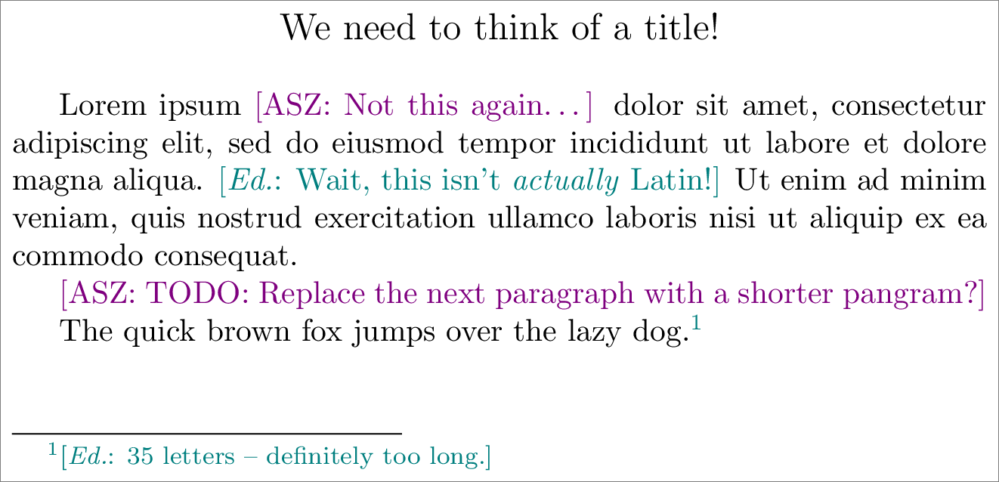
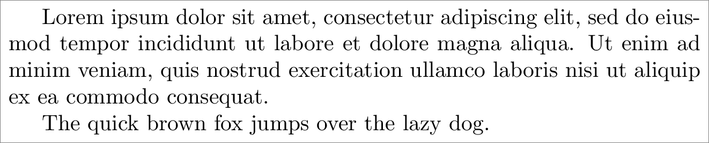

The `draft` package
===================

A LaTeX package for commands that exist only when a document is in draft mode,
including per-author color-coded inline notes.

Example usage:

```LaTeX
\documentclass{article}

\usepackage{draft}
%\draftfalse

\newnote{asz}{violet}
\newnote[\emph{Ed.}]{ed}{teal}

\begin{document}

\whendraft{\centerline{\large We need to think of a title!}\bigskip}

Lorem ipsum \asz{Not this again\ldots} dolor sit amet, consectetur adipiscing
elit, sed do eiusmod tempor incididunt ut labore et dolore magna aliqua.
\ed{Wait, this isn't \emph{actually} Latin!}  Ut enim ad minim veniam, quis
nostrud exercitation ullamco laboris nisi ut aliquip ex ea commodo consequat.

\asz{TODO: Replace the next paragraph with a shorter pangram?}

The quick brown fox jumps over the lazy dog.\edfoot{35 letters -- definitely too long.}

\end{document}
```

With `\draftfalse` commented out, the document is in draft mode, and appears
with all the notes:



However, turning off draft mode by uncommenting `\draftfalse` produces a
document without any notes, and without any stray spaces:



Most common package interface
-----------------------------

The simplest way to interface with the `draft` package is through the five
commands `\drafttrue`, `\draftfalse`, `\newnote`, `\noteformat`, and
`\whendraft`.

* Including the `draft` package turns on “draft mode”.  To turn it off, issue
  the command `\draftfalse`; to explicitly turn it on, issue the command
  `\drafttrue`.  This package provides a variety of *draft-only commands*;
  anything that’s “draft-only” will vanish entirely, as though it were not even
  present, if draft mode is disabled.  (Importantly, this means that, for
  example, placing a draft-only command in between spaces will *not* produce
  extra space in the non-draft document.)

* <code>\\newnote{*author*}{*color*}</code> defines a new command
  <code>\\*author*{#1}</code> which inserts a draft-only note into the document.
  The note is in the given <code>*color*</code>, and is (by default) formatted
  as <code>[*AUTHOR*: #1]</code> (where <code>*AUTHOR*</code> is the
  `\uppercase` version of the command name).  To customize the author name, an
  optional argument can be provided to `\newnote`, so that
  <code>\\newnote[*author*]{*cmd*}{*color*}</code> defines
  <code>\\*cmd*{#1}</code>, whose resulting note is formatted as
  <code>[*author*: #1]</code>.  The `\newnote` command also defines an
  <code>\\*author*foot{#1}</code> (or <code>\\*cmd*foot{#1}</code>) variant,
  which inserts the same formatted note as a footnote.

* <code>\\noteformat{*format*}</code> allows you to change the default
  <code>[*AUTHOR*: *content*]</code> format of notes; the new format is given by
  <code>*format*</code>, where `#1` will be replaced by the note’s
  <code>*AUTHOR*</code> and `#2` will be replaced by the note’s
  <code>*content*</code>.  (So to get the default format, this package specifies
  `\noteformat{[#1: #2]}`.)

* <code>\\whendraft{*content*}</code> is a more general draft-only command; it
  is equivalent to <code>*content*</code> in draft mode and vanishes otherwise.
  It can be used for other draft-specific reminders that aren’t per-author
  notes.

All macros provided by this package
-----------------------------------

The `draft` package also includes more macros; the complete list follows.  A
command described as being *draft-only* will vanish entirely, as though it were
not even present, if draft mode is disabled via `\draftfalse`.  Importantly,
this means that, for example, placing a draft-only command in between spaces
will *not* produce extra space in the non-draft document; similarly, placing it
in its own paragraph will *not* produce an extra paragraph, etc.

### General-purpose draft commands

The package provides some general-purpose facilities for having commands and/or
portions of the document that only appear in draft mode.
  
* <code>\\whendraft{*content*}</code> is the simplest draft-only command; it is
  equivalent to <code>*content*</code> if the document is in draft mode, and
  vanishes otherwise.  It is the simplest general-purpose interface to draft
  mode.

* `\NewDraftCommand`, `\RenewDraftCommand`, and `\ProvideDraftCommand` are for
  defining draft-only commands.  These commands function exactly like
  `\newcommand`, `\renewcommand`, and `\providecommand`, respectively, except
  the defined command is draft-only.  For example, `\whendraft` is defined as
  `\NewDraftCommand{\whendraft}[1]{#1}`.  If you want to define your own
  draft-only commands, this is the interface for doing so.

* `\ifdraft`, `\drafttrue` (default), and `\draftfalse` are what define “draft
  mode”.  The `\ifdraft` command is a TeX-style `\if`; the document is in draft
  mode precisely when `\ifdraft` is enabled.  If not even `\NewDraftCommand` is
  flexible enough for your desired draft-mode shenanigans, then you can work
  with `\ifdraft` directly.

### Draft notes

One common use case for draft-only commands is for document authors to insert
notes that should only appear in draft mode.  The `draft` package provides
support for such notes, and for defining per-author color-coded commands to
insert them.

* <code>\\makedraftnote{*color*}{*author*}{*content*}</code> and
  <code>\\makedraftfootnote{*color*}{*author*}{*content*}</code>
  *unconditionally* render a draft note by <code>*author*</code> in the given
  <code>*color*</code> with body <code>*content*</code>.  The formatting is that
  specified by `\noteformat`; by default, this means
  <code>[*author*: *content*]</code>.  The `\makedraftnote` command places this
  note directly in the document; the `\makedraftfootnote` variant places this
  content in a footnote, and colors the footnote markers with the appropriate
  <code>*color*</code>.  (The footnote markers will vanish if the document is
  not in draft mode; note that this will renumber the footnotes.)  Note that
  these commands *always* typeset the note; see `\draftnote` and
  `\draftfootnote` for draft-only variants.

* <code>\\draftnote{*color*}{*author*}{*content*}</code> and
  <code>\\draftfootnote{*color*}{*author*}{*content*}</code> are draft-only
  variants of `\makedraftnote` and `\makedraftfootnote`, respectively.
  
* <code>\\noteformat{*format*}</code> allows you to specify the format of notes
  rendered by `\makedraftnote`; the new format is given by
  <code>*format*</code>, where `#1` will be replaced by the note’s
  <code>*author*</code> and `#2` will be replaced by the note’s
  <code>*content*</code>.  For example, the default
  <code>[*author*: *content*]</code> format is given by `\noteformat{[#1: #2]}`.

* <code>\\newnote[*author*]{*cmd*}{*color*}</code> defines two new draft-only
  commands, <code>\\*cmd*{#1}</code> and <code>\\*cmd*foot{#1}</code>, which
  insert a `\draftnote` and a `\draftfootnote`, respectively.  The note’s
  <code>*color*</code> and <code>*author*</code> are given by `\newnote`; the
  content is specified by the resulting commands.  If <code>*author*</code> is
  omitted, then it defaults to <code>\uppercase{*cmd*}</code>.

### Implementation/utility commands

The `draft` package also uses some commands to define its draft-mode machinery
that may be more broadly useful, but that do not directly relate to draft mode.

* <code>\\NewDefinerWrapper{\\*newcommandish*}{\\*wrapped*}{*body*}</code> is a
  way to produce commands like `\newcommand` (and friends) that modify the
  defined command’s body.  It takes the command <code>\\*newcommandish*</code>,
  which should have the same syntax as `\newcommand`, and defines the new
  command <code>\\*wrapped*</code>, which also has the same syntax as
  `\newcommand`.  This <code>\\*wrapped*</code> command functions just like
  <code>\\*newcommandish*</code>, except that the body of the defined command is
  replaced by <code>*body*</code>, within which `#5` expands to the original
  (now wrapped) body.
  
  As an example:
 
      \NewDefinerWrapper{\newcommand}{\NewParentheticalCommand}{(#5)}
 
  defines a new command `\NewParentheticalCommand` such that
 
      \NewParentheticalCommand{\pbolded}[1]{\textbf{#1}}
 
  is the same as
 
      \newcommand{\pbolded}[1]{(\textbf{#1})}
 
  (note the parentheses around the bolding).

* <code>NewStdDefinerWrappers{*CommandSuffix*}{*body*}</code> uses
  `\NewDefinerWrapper` to define three commands for defining commands:
  
  * <code>\\New*CommandSuffix*</code>, which wraps `\newcommand` with
    <code>*body*</code>.
  * <code>\\Renew*CommandSuffix*</code>, which wraps `\renewcommand` with
    <code>*body*</code>.
  * <code>\\Provide*CommandSuffix*</code>, which wraps `\providecommand` with
    <code>*body*</code>.

  Just as with `\NewDefinerWrapper`, <code>*body*</code> uses `#5` to refer to
  the original (now wrapped) body.
